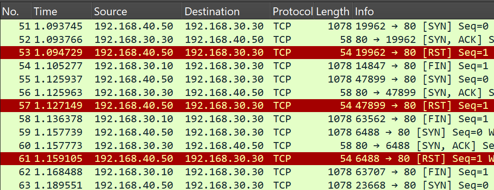
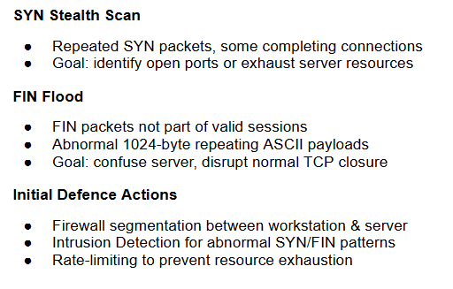
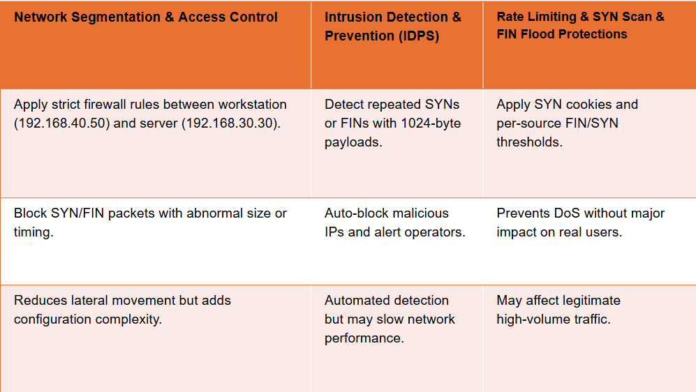
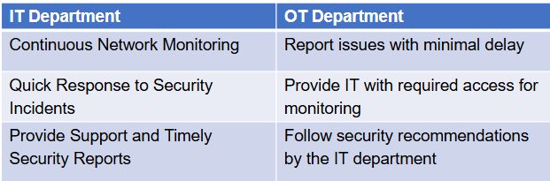
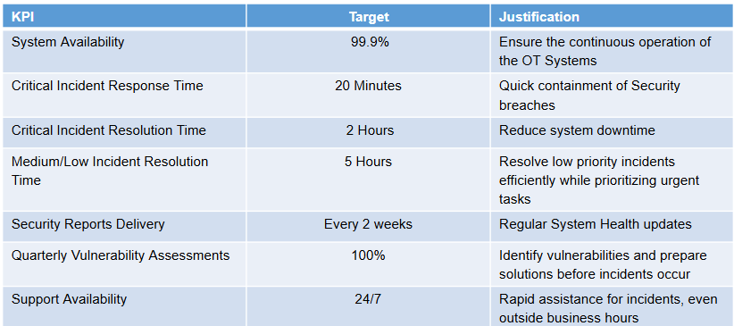

# Network Traffic Analysis - Wireshark

## Project Overview

The project involved analysing a provided network packet capture to
demonstrate normal TCP behaviour, identify abnormal TCP traffic and
potential attacks, propose mitigation strategies, and develop Service
Level Agreement (SLA) criteria between an IT department and an
Operational Technology (OT) department.

This project have been completed as part of CAB222 Networks 
Assessment 2 for Bachelors's Degree in Information Technology at 
Queensland University of Technology (QUT).

**Group:** 59
**My contribution:** Responsible for **Section 2 ---
Identification of Abnormal TCP Traffic and Potential Attacks**
and partially for **Section 3 --- Mitigation Strategies**.

> **Note:** This was a four-person university project. The analysis and
> documentation below represent the group's work. The names of the team members
> have been omitted for the sake of privacy.

------------------------------------------------------------------------

## Contents

1.  [Normal TCP Behaviour](#1-normal-tcp-behaviour)
2.  [Identification of Abnormal TCP
    Traffic and Potential Attacks](#2-identification-of-abnormal-tcp-traffic-and-potential-attacks)
3.  [Mitigation Strategies](#3-mitigation-strategy)
4.  [Service Level Agreement](#4-service-level-agreement)
5.  [Key Skills and Concepts](#5-key-skills-and-concepts)
6.  [Project Structure](#6-project-structure)

------------------------------------------------------------------------

# 1. Normal TCP Behaviour

TCP (Transmission Control Protocol) provides reliable and error-checked
data delivery across a network.


TCP communication can be divided into three main stages:

### 1.1 Connection Establishment

A **three-way handshake** is used to establish a connection between a
client and server:

1.  **SYN** --- The client initiates a connection.
2.  **SYN-ACK** --- The server acknowledges the request and responds.
3.  **ACK** --- The client acknowledges the server's response and the
    connection is established.

### 1.2 Data Transfer

After the connection has been established, data is divided into smaller
TCP segments and transmitted across the network.

Each segment contains information such as sequence and acknowledgement
numbers, allowing TCP to manage reliable delivery.

### 1.3 Connection Termination

When communication is complete, the TCP connection is closed using a
**four-way FIN/ACK exchange**.

### 1.4 Normal Traffic Observed in the Capture File

The packet capture contained an example of a normal TCP connection
between:

-   **Client:** `192.168.40.40`
-   **Server:** `192.168.30.30`

The observed sequence was:


This sequence represents a normal three-way TCP handshake between **Gail
(`192.168.40.40`)** and the **HTTP server (`192.168.30.30`)**.

Following the handshake, the capture contains:


This demonstrates application-layer HTTP communication following
successful TCP connection establishment.

The sessions then is terminated using FIN/ACK exchanges, demonstrating
normal TCP connection termination:


------------------------------------------------------------------------

# 2. Identification of Abnormal TCP Traffic and Potential Attacks

Analysis of the network capture revealed multiple TCP abnormalities
beginning around **line 31** of the packet capture.

A significant abnormality was that both FIN and SYN packets contained
**1024-byte data segments consisting of repeating ASCII symbols**.

This behaviour is inconsistent with the expected use of these TCP flags.
In particular, SYN packets would normally establish a connection without
carrying this type of payload, while FIN packets are normally associated
with connection termination rather than large application-data payloads.

Two potential attacks were identified from the traffic patterns.

------------------------------------------------------------------------

## 2.1 FIN Flooding

The capture contained FIN packets being sent at short intervals from the
same source address.

The packets:

-   Used the **FIN** flag.
-   Were not part of a normal four-way TCP connection termination.
-   Contained abnormal **1024-byte repeating ASCII payloads**.
-   Appeared to originate from `192.168.30.10` according to the report.
-   Could cause the server to process connection termination requests
    for connections that do not exist.

The observed behaviour was interpreted as a likely **FIN flood /
Denial-of-Service (DoS) attack**.

The attack begins around **line 31** in the capture.

### Screenshots --- FIN Flood


------------------------------------------------------------------------

## 2.2 Stealth SYN Scan

A second abnormal traffic pattern begins around **line 51**.

The traffic contains repeated SYN requests followed by server responses
and then RST packets rather than the normal completion of the TCP
three-way handshake.

The observed pattern is:

``` text
SYN → SYN-ACK → RST
```

Instead of:

``` text
SYN → SYN-ACK → ACK
```

This behaviour is consistent with a **stealth SYN scan**.

The technique can be used to determine which server ports respond to
connection attempts without completing a normal TCP connection.

The observed traffic originated from `192.168.40.50` according to the
report.

The analysis also considered other possible purposes for the traffic,
including consuming server resources or checking whether the server was
still operational.

### Screenshot --- Stealth SYN Scan



------------------------------------------------------------------------

## 2.3 Abnormal Payloads

A notable feature across the abnormal traffic was the presence of
**1024-byte repeating ASCII payloads**.

These payloads appeared in packets that would not normally be expected
to carry this type of data, particularly the SYN and FIN packets
identified during the analysis.

The combination of:

-   Unusual TCP flags
-   Repeated connection attempts
-   Incomplete handshakes
-   Abnormal payload sizes
-   Repeated traffic from the same source addresses

serves to identify the traffic as potentially malicious.

### Screenshot --- Abnormal Packets Payload


------------------------------------------------------------------------

## 2.4 Attack Summary



------------------------------------------------------------------------

# 3. Mitigation Strategies

Several mitigation strategies were proposed to reduce the likelihood and
impact of the identified traffic patterns.

## 3.1 Network Segmentation and Access Control

Strict firewall rules can be applied between the workstation and server
network segments.

In this scenario, the proposed segmentation separates:

-   **Workstation:** `192.168.40.50`
-   **HTTP Server:** `192.168.30.30`

The firewall could be configured to:

-   Restrict unnecessary communication between network segments.
-   Block abnormal packets.
-   Block SYN/FIN packets with suspicious characteristics.
-   Enforce appropriate network access controls.

Network segmentation can also limit lateral movement if another system
within the network becomes compromised.

A limitation identified in the report is that segmentation can become
complex to design and maintain in larger OT environments.

------------------------------------------------------------------------

## 3.2 Intrusion Detection and Prevention Systems

An **Intrusion Detection and Prevention System (IDPS)** could be used to
identify abnormal network behaviour.

Detection rules could identify characteristics such as:

-   Repeated SYN packets.
-   Repeated FIN packets.
-   1024-byte payloads in unusual TCP packets.
-   Rapid connection attempts.
-   Suspicious SYN → SYN-ACK → RST patterns.

An IDPS could potentially block malicious traffic and alert operators.

A limitation is that extensive inspection and prevention mechanisms may
introduce additional network processing overhead.

------------------------------------------------------------------------

## 3.3 Rate Limiting and SYN Flood Protection

Rate limiting can restrict the number of connection attempts or FIN/SYN
packets accepted from a source within a given period.

The report also proposed **SYN cookies** as a method of reducing the
impact of automated flooding.

Potential controls include:

-   Per-source SYN thresholds.
-   Per-source FIN thresholds.
-   Rate limits on connection attempts.
-   SYN cookies.
-   Protection against abnormal SYN/FIN traffic.

Aggressive rate limits may potentially affect legitimate high-volume
traffic, so thresholds would need to be configured appropriately.

------------------------------------------------------------------------

## 3.4 Mitigation Summary



------------------------------------------------------------------------

# 4. Service Level Agreement

The project also proposed SLA criteria between the **IT department** and
**OT department**.

The purpose of the SLA was to establish clearly defined responsibilities
and measurable targets for maintaining network availability, responding
to incidents, and providing security monitoring and reporting.

## 4.1 Responsibilities



------------------------------------------------------------------------

## 4.2 Availability Standards

The proposed SLA specifies:

-   **99.9% uptime** for network monitoring and security services.
-   Penalties for non-approved downtime exceeding 30 minutes.
-   Up to four hours of monthly maintenance downtime.

------------------------------------------------------------------------

## 4.3 Incident Response

The proposed response targets were:
```text

  Incident Type                          Target
  -------------------------------- ------------
  Critical incident response         20 minutes
  Critical incident resolution          2 hours
  Medium/Low incident resolution        5 hours
  Support availability                     24/7
```

The proposal also included email/chat support outside normal business hours.

------------------------------------------------------------------------

## 4.4 Security Reporting

The proposed SLA included:

-   Continuous network health monitoring.
-   Continuous vulnerability scanning.
-   Security reports every two weeks.
-   Quarterly vulnerability assessments across OT systems.

## 4.5 SLA KPI Summary



------------------------------------------------------------------------

# 5. Key Skills and Concepts

This project provided practical experience with several networking and
technical analysis concepts.

### Networking

-   TCP/IP fundamentals
-   TCP three-way handshake
-   TCP connection termination
-   TCP flags
-   SYN, SYN-ACK, ACK, FIN and RST packets
-   Client/server communication
-   HTTP over TCP
-   Network segmentation
-   Firewall concepts
-   Rate limiting

### Network Traffic Analysis

-   Wireshark packet analysis
-   Identifying normal network behaviour
-   Identifying abnormal traffic patterns
-   Analysing source and destination addresses
-   Examining TCP flags and packet sequences
-   Investigating packet payloads
-   Recognising potential network attacks

### Security Concepts

-   Denial-of-Service attacks
-   FIN flooding
-   Stealth SYN scanning
-   Intrusion Detection and Prevention Systems
-   SYN flood protection
-   Access control
-   Network segmentation
-   Security monitoring

### Technical and Professional Skills

-   Systematic problem analysis
-   Evidence-based investigation
-   Technical documentation
-   Research
-   Group collaboration
-   Presentation of technical findings

------------------------------------------------------------------------

# 6. Project Structure

``` text
Network-Packet-Analysis/
│
├── README.md
│
├── assets/
│   ├── 01-tcp-handshake.png
│   ├── 02-file-connection.png
│   ├── 03-file-transfer.png
│   ├── 04-file-termination.png
│   ├── 05-attack-FIN1.png
│   ├── 06-attack-FIN2.png
│   ├── 07-attack-dropped.png
│   ├── 08-attack-summary.png
│   ├── 09-mitigation-summary.png
│   ├── 10-SLA-responsibilities.png
│   ├── 11-SLA-KPI.png
│   └── Traffic Analysis Capture File 2025 v1.pcap
│
└── documentation/
    ├── Packet Analysis Presentation.pdf
    └── Paclet Analysis Report.pdf
```

------------------------------------------------------------------------

## My Contribution

My primary contribution to this project was **Section 2 ---
Identification of Abnormal TCP Traffic** and partially 
**Section 3 --- Mitigation Strategies**.

My work included:

-   Identifying normal TCP traffic behaviour.
-   Identifying abnormal TCP traffic behaviour.
-   Analyzing TCP packet flags.
-   Analyzing packet payloads.
-   Identifying patterns.
-   Identifying potential attack types and their purpose.
-   Researching mitigation strategies for identified attacks.